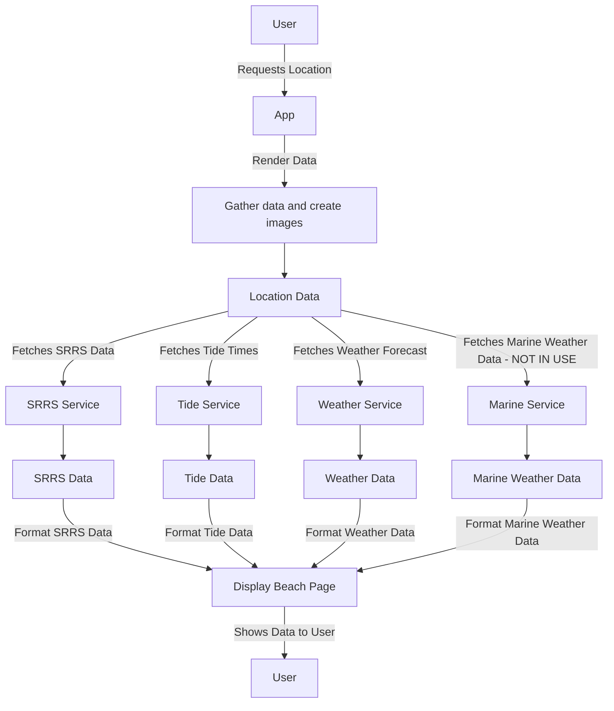

# Project Documentation

This project consists of several important documentation files that provide essential information about the application, its structure, and deployment processes. Below is a brief description of each markdown file available in this repository:

## Documentation Files

- **[dockerbuildReadme.md](dockerbuildReadme.md)**  
  A guide on how to build and push the Docker image to Docker Hub. This document contains instructions for maintaining and updating the Docker setup for the application.

- **[codeOverview.md](codeOverview.md)**  
  An overview of the code flow and database structure. This document provides insights into the architecture of the application, including how different components interact with each other.

- **[readme.md](readme.md)**  
  The main project documentation that outlines the purpose of the project, installation instructions, usage details, and other relevant information for users and developers.

For further details, please refer to the respective markdown files.

# BlueWave Watch

**Monitoring water quality and tides for safe swimming.**

## Overview

BlueWave Watch is a Flask web application designed to provide essential information for beachgoers, including water quality, tidal conditions, and weather forecasts. By fetching and displaying real-time data from various sources, the application helps users make informed decisions about swimming and beach activities.

## Features

- **Location Data Retrieval**: Fetches and displays data from the Surfers Against Sewage (SAS) through the SSRS (Surfers Against Sewage Reporting System).
- **Tide Information**: Retrieves tide times and generates visual representations of tide tables, including high and low tide indicators.
- **Weather Forecasts**: Accesses weather forecasts based on user-selected beach locations to provide up-to-date meteorological information.
- **Data Caching**: Utilizes SQLite to cache data locally, reducing API calls and improving response times.
- **User-Friendly Interface**: A responsive web design that works well on both desktop and mobile devices, allowing users to easily navigate and find information.

## Application Structure

- **`app.py`**: The main application file where Flask routes are defined. It handles the logic for fetching and displaying data.
- **`models.py`**: Contains SQLAlchemy models that define the structure of the database tables used for caching location, tide, and weather data.
- **`db.py`**: Responsible for initializing the SQLite database and managing session handling with SQLAlchemy.
- **`utils.py`**: Utility functions for cleaning JSON data, handling exceptions, and pretty-printing JSON responses.
- **`services/`**: A directory containing modules for interacting with external APIs:
  - **`ssrs_service.py`**: Fetches location data from the SAS.
  - **`tide_service.py`**: Retrieves tide times and creates tide tables.
  - **`weather_service.py`**: Gets weather forecasts for specified locations.
  - **`marine_service.py`**: Fetches marine weather data, if available.


## Usage

- **Homepage**: Upon accessing the homepage, users can view a list of available beach locations.
- **Selecting a Beach**: Click on a beach name to view detailed information, including tide data, weather forecasts, and water quality indicators.
- **Tide Tables**: Tide information is presented in a visually appealing table format, allowing users to quickly assess high and low tides.
- **Data Display**: Information is displayed in sections, including tide times, weather forecasts, and other relevant data, all tailored to the selected beach location.


## Contributing

Contributions are welcome! To contribute:
1. Fork the repository.
2. Create a new branch for your feature or bug fix.
3. Make your changes and commit them with descriptive messages.
4. Submit a pull request for review.

## Acknowledgements

- **Surfers Against Sewage (SAS)**: [SAS Website](https://www.sas.org.uk)
- **Tide Times**: [Tide Times Website](https://www.tidetimes.co.uk)
- **Open-Meteo**: [Open-Meteo API](https://api.open-meteo.com)

## Flow Diagram



## Data Storage Diagram

```mermaid
erDiagram
    SSRSLocationData {
        Integer id PK
        String data
        DateTime last_updated
    }
    TideTimesData {
        Integer id PK
        Float latitude
        Float longitude
        String data
        DateTime last_updated
    }
    WeatherForecastData {
        Integer id PK
        Float latitude
        Float longitude
        String data
        DateTime last_updated
    }
    MarineWeatherData {
        Integer id PK
        Float latitude
        Float longitude
        String data
        DateTime last_updated
    }

    SSRSLocationData ||--o{ TideTimesData : has
    SSRSLocationData ||--o{ WeatherForecastData : has
    SSRSLocationData ||--o{ MarineWeatherData : has
